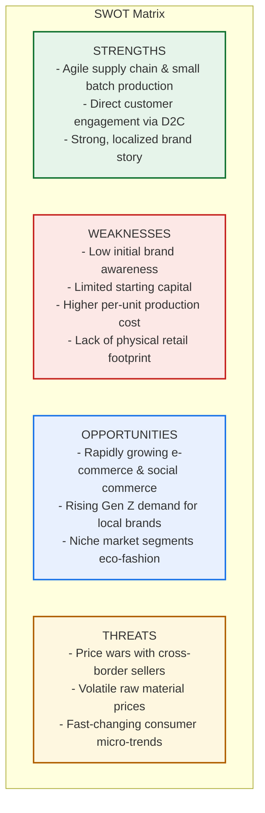

# CHAPTER 2: INDUSTRY & MARKET ANALYSIS

## 2.1 Vietnam Fashion Market Analysis

### 2.1.1 Overview of Vietnam's Fashion Industry
Vietnam's fashion industry has transitioned into one of the most dynamic consumer markets in Southeast Asia. This expansion is powered by robust macroeconomic growth, rapid urbanization, rising disposable income, and a highly connected youth demographic. Beyond its established role as a global manufacturing powerhouse, Vietnam’s domestic fashion market has grown significantly, offering rich opportunities for local startups.

According to the *Vietnam Fashion Industry Report 2026*, the domestic apparel market reached approximately **USD 7.2 billion in 2025**, representing a **12% year-on-year growth** compared to 2024. Concurrently, Vietnam’s textile and garment export turnover reached approximately **USD 48 billion**, maintaining its position among the world's top three apparel exporters. These figures reflect a unique combination of high-capacity local manufacturing and expanding domestic demand.

Currently, Vietnam's textile sector comprises over **7,000 enterprises** employing roughly **3 million workers**. Domestic brands capture around **55–60% of the local apparel market share**, proving that Vietnamese consumers are actively supporting local brands alongside global fast-fashion retail giants.

---

### 2.1.2 Market Characteristics
The steady expansion of the domestic fashion market is characterized by several key drivers:

1. **Young and Connected Demographics**
   * Vietnam has a population exceeding 100 million, with nearly **70% under the age of 40**. 
   * This cohort is highly fashion-conscious, active on social media, and open to experimenting with new styles.
2. **Income Growth and Premiumization**
   * Increasing household disposable income is shifting consumer purchasing habits from "affordability-first" to prioritizing **design authenticity, fabric quality, and brand identity**.
3. **Digital and E-commerce Dominance**
   * Social commerce and digital marketplaces have lowered market entry barriers. Consumers purchase fashion products primarily through:
     * **Multi-brand marketplaces**: Shopee, TikTok Shop, Lazada.
     * **Social platforms**: Facebook Pages/Groups, Instagram.
     * **D2C channels**: Brand websites with integrated checkout.
4. **Rise of Local Brands (The "Local Brand" Movement)**
   * Vietnamese consumers are showing a strong affinity for home-grown fashion brands.
   * Although international conglomerates (e.g., Zara, H&M, Uniqlo) generate high sales per store, local brands are expanding faster in terms of new product lines and total retail distribution touchpoints due to localized design fit and competitive pricing.

---

## 2.2 Consumer Behaviour & Market Segmentation

### 2.2.1 Core Purchasing Decision Factors
Vietnamese fashion consumers balance several factors when buying apparel:
* **Product Quality & Fit**: Tailoring fits specifically designed for Asian body sizes.
* **Affordable Pricing**: Seeking a high value-to-price ratio.
* **Material Comfort**: High demand for breathable, sweat-wicking materials due to Vietnam's tropical climate.
* **Social Proof**: Heavy reliance on TikTok/Instagram reviews, customer ratings, and KOL/KOC recommendations.
* **Eco-Consciousness**: An emerging segment of Gen Z consumers actively seeks sustainable and ethically manufactured products.

---

### 2.2.2 Market Segmentation
To effectively position a fashion startup, the market can be segmented into three distinct groups:

| Segment | Target Audience | Key Behaviors | Startup Strategy |
| :--- | :--- | :--- | :--- |
| **Mass Market (Giá rẻ)** | Students, low-income workers. | Price-sensitive, purchases mainly on Shopee/Lazada, follows fast-fashion micro-trends. | High volume, low margins, rapid trend replication. |
| **Mid-Range / Local Brand (Trung cấp)** | Young professionals, college students, Gen Z/Millennials. | Focuses on brand identity, aesthetic uniqueness, and social proof. Willing to pay a premium for cool designs. | Direct-to-Consumer (D2C), strong social commerce presence, community building. |
| **Premium / Designer (Cận cao cấp)** | High-income individuals, fashion enthusiasts. | Prioritizes premium fabric, exclusive designs, and personalization. | Limited drops, offline showroom experiences, VIP loyalty programs. |

---

## 2.3 Market Trends
Several key trends are redefining the fashion landscape in Vietnam:

* **Social Commerce & Live-selling**: Livestream shopping on TikTok Shop and Shopee Live has become a primary conversion channel, allowing immediate interaction and instant purchase.
* **Green Fashion & Sustainability**: Increased demand for organic cotton, recycled polyester, and circular fashion programs (e.g., old clothes exchange).
* **AI-assisted Personalization**: Use of AI chatbots for size recommendations, virtual try-ons, and personalized marketing automation to improve conversion rates.
* **Omnichannel Retail**: Seamless integration between online platforms and offline pop-up showrooms or concept stores.

---

## 2.4 Market Opportunities for Startups
* **Direct-to-Consumer (D2C) Model**: Startups can leverage local manufacturing to bypass middlemen, offering high-quality apparel directly to consumers at competitive prices.
* **Niche Positioning (Streetwear/Minimalism)**: High growth in niche fashion segments like streetwear, techwear, or office-to-casual wear.
* **Eco-friendly Segments**: Unexplored opportunities in sustainable fashion, organic activewear, and eco-conscious kidswear.
* **E-commerce Ecosystem**: Low barriers to entry utilizing TikTok Shop's affiliate network and Shopee's logistics.

---

## 2.5 Market Challenges
* **Fierce Competition**: High competition from Chinese cross-border e-commerce sellers offering extremely low prices and fast shipping, alongside global giants like Uniqlo and Zara.
* **Micro-trend Fatigue**: Fashion cycles are shrinking, requiring startups to have an ultra-fast design-to-production lifecycle.
* **Rising Customer Acquisition Cost (CAC)**: Increasing digital advertising costs on Facebook and TikTok force brands to focus on organic content and retention.
* **Supply Chain Constraints**: High dependency on imported raw fabrics (mostly from China), making startups vulnerable to supply chain disruptions.

---

## 2.6 SWOT Analysis for the Startup

| **STRENGTHS (Điểm mạnh)** | **WEAKNESSES (Điểm yếu)** |
| :--- | :--- |
| • **Agile Production**: Ability to manufacture in small batches (low MOQ), reducing inventory risk. • **Localized Aesthetic**: Deep understanding of local consumer fit, climate, and cultural trends. • **D2C Advantage**: High margins and direct customer relationship ownership. | • **Brand Equity**: Zero initial brand recognition in a crowded market. • **Resource Constraints**: Limited budget for large-scale marketing campaigns. • **Higher Unit Costs**: Lower production volumes lead to higher raw material costs per piece. |
| **OPPORTUNITIES (Cơ hội)** | **THREATS (Thách thức)** |
| • **Social Commerce Growth**: High conversion rates through TikTok Shop and Shopee Live. • **Rising Middle Class**: Consumers willing to pay more for local identity and quality. • **Green Market Niche**: Growing demand for sustainable and transparently produced clothing. | • **Price Competition**: Fierce price wars with low-cost Chinese fast-fashion imports. • **Micro-trend Shifts**: The risk of leftover stock if a micro-trend fades rapidly. • **Raw Material Risks**: Vulnerability to price spikes and delays in imported fabrics. |

---

## 2.7 Key Local Competitors Reference

1. **Coolmate**
   * *Model*: Basic menswear D2C, online-only.
   * *Strengths*: Exceptional customer service (60-day return policy), great basic product quality, optimized tech platform.
   * *Lesson*: Focus on customer trust and basic wardrobe needs.
2. **Dirty Coins / Teelab**
   * *Model*: Gen Z streetwear.
   * *Strengths*: Highly unique graphic designs, strong community following, viral marketing.
   * *Lesson*: Build a strong community and clear visual brand identity.
3. **Routine**
   * *Model*: Smart casual clothing, omnichannel.
   * *Strengths*: Large physical store network, diverse product lines (men/women).
   * *Lesson*: Omnichannel is essential for scaling up brand authority.

---

## References (APA 7th)
* DPS Media. (2026). *Vietnam Fashion Industry Report 2026*. https://dps.media/en/vietnam-fashion-industry-report-2026/
* FiinGroup. (2025). *Vietnam Retail Fashion: Loving Global, Buying Local*. https://dff.fiingroup.vn/NewsInsights/Detail/11363133
* Vietnam News. (2025). *Vietnamese textiles and garments account for nearly 60% of the domestic market share*. https://www.vietnam.vn/en/hang-det-may-viet-chiem-gan-60-thi-phan-tai-thi-truong-noi-dia
* Vietnam Textile and Apparel Association (VITAS). (2025). *Vietnam's textile exports expected to top US$46 billion in 2025*. https://en.vneconomy.vn/vietnams-textile-exports-expected-to-top-46-bln-in-2025.htm
